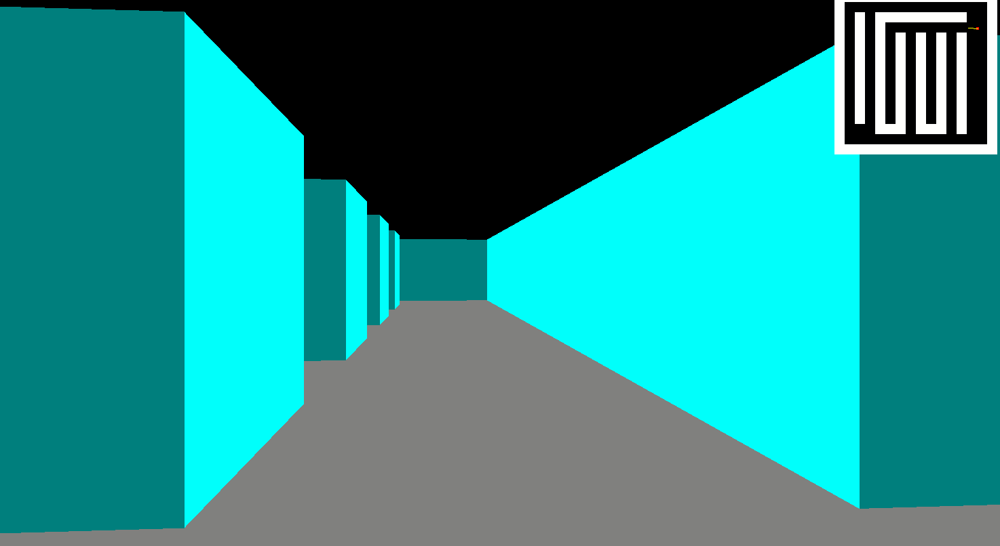

This page showcases all the projects I have worked on, from personal to professional ones. Explore and find out more about my work!

1. **[JSON Parser](https://github.com/Markkimotho/json-parser)**: The JSON Parser is a simple application designed to parse JSON data. Users can either enter JSON data directly or upload a JSON file for parsing. The application provides a user-friendly interface to visualize and validate JSON structures.

2. **[Raycasting Engine in C](https://github.com/Markkimotho/sdl-c-raycasting)**: A raycasting engine built from scratch.

3. **[ccwc](https://github.com/Markkimotho/ccwc)**: `ccwc` is a command-line utility that provides various statistics about a given file, similar to the Unix `wc` tool. It counts the number of bytes, lines, words, and characters (including multibyte characters) in the specified file.

4. **[User Onboarding](https://user-onboarding-47b042304e8f.herokuapp.com/)**: The User Onboarding Project is a comprehensive web application designed to capture the entire user onboarding journey. It includes functionalities for user signup, login, forgot password, reset password, user verification, and user preferences.

